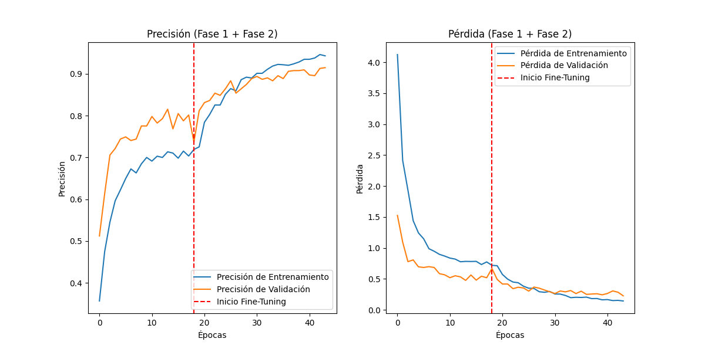
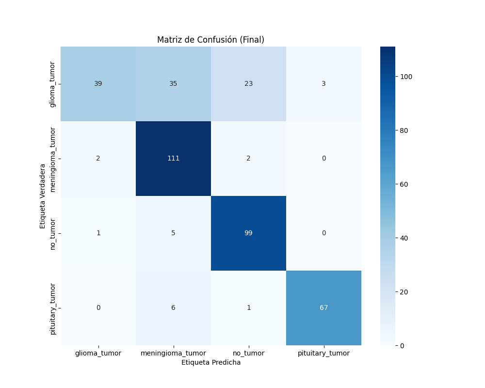

# 🧠 Clasificación de Tumores Cerebrales (MRI) mediante Aprendizaje por Transferencia

## 📘 Resumen del Proyecto

Este repositorio contiene el código fuente para un proyecto de **Deep Learning** enfocado en la **clasificación de imágenes de Resonancia Magnética (MRI)** cerebrales.  
El objetivo es clasificar las imágenes en cuatro categorías distintas:

- `glioma_tumor`
- `meningioma_tumor`
- `pituitary_tumor`
- `no_tumor` (tejido cerebral sano)

El proyecto implementa un pipeline completo que abarca desde el **preprocesamiento de datos** hasta el **entrenamiento de una CNN (Red Neuronal Convolucional)** y su **despliegue en una aplicación web (Flask)**.

Este trabajo se inspira en la aplicación industrial de la Inteligencia Artificial en el radiodiagnóstico, sirviendo como **prueba de concepto** para un sistema de asistencia al diagnóstico médico.

---

## 📊 Dataset

El proyecto utiliza el dataset público **[Brain Tumor Classification (MRI)](https://www.kaggle.com/datasets/sartajbhuvaji/brain-tumor-classification-mri/data)** de Kaggle.

La estructura se divide en dos conjuntos: **Training** y **Testing**.

### Datos de Entrenamiento (`Training/`)
- glioma_tumor: 826 archivos  
- meningioma_tumor: 822 archivos  
- no_tumor: 395 archivos  
- pituitary_tumor: 827 archivos  

### Datos de Prueba (`Testing/`)
- glioma_tumor: 100 archivos  
- meningioma_tumor: 115 archivos  
- no_tumor: 105 archivos  
- pituitary_tumor: 74 archivos  

> 🔸 Se identificó un **desbalance de clases** en el conjunto de entrenamiento: la clase `no_tumor` (395) es una minoría significativa frente a las clases tumorales (~820).

---

## 🧬 Metodología

Para abordar la complejidad y similitud visual entre las clases, se implementó una estrategia de **Aprendizaje por Transferencia (Transfer Learning)** con **Ajuste Fino (Fine-Tuning)**.

---

## 🏗️ Modelo Base: VGG16

El modelo **VGG16**, preentrenado en **ImageNet**, se usó como *backbone* para la extracción de características.  
Sobre esta base se construyó un nuevo clasificador con las siguientes capas:

- `GlobalAveragePooling2D`
- `Dropout` (para regularización)
- `Dense` con activación `softmax` (4 clases de salida)

---

## ⚙️ Estrategia de Entrenamiento en Dos Fases

1. **Fase 1 – Entrenamiento del Clasificador (Head):**  
   Se congelaron todas las capas del backbone (VGG16).  
   Solo se entrenó el clasificador con tasa de aprendizaje estándar (`1e-3`).

2. **Fase 2 – Ajuste Fino (Fine-Tuning):**  
   Se descongeló el último bloque convolucional (`block5_conv1` en adelante).  
   El modelo se recompiló con tasa de aprendizaje baja (`1e-5`).

En ambas fases se usó **EarlyStopping** monitorizando `val_loss` para restaurar los mejores pesos y prevenir sobreajuste.

---

## ⚖️ Gestión de Desbalance de Clases

Para compensar el desbalance, se aplicó **ponderación de clases** (`class weights`) calculada con `sklearn.utils.compute_class_weight`.  
Esto penaliza más los errores en la clase minoritaria (`no_tumor`), equilibrando el aprendizaje.

---

## 🔁 Aumento de Datos (Data Augmentation)

Se aplicó una capa de aumento robusta al inicio del pipeline:

- `RandomFlip` (horizontal)  
- `RandomRotation` (±20%)  
- `RandomZoom` (±20%)  
- `RandomContrast` (±20%)  
- `RandomBrightness` (±20%)  

Estas transformaciones mejoran la **generalización** y reducen la **confusión entre clases visualmente similares**.

---

## 📈 Resultados y Evaluación

El modelo final se evaluó sobre el conjunto de **Testing (394 imágenes)**.

### Historial de Entrenamiento


**Figura 1.** Curvas de precisión y pérdida durante el entrenamiento.  

La línea roja marca el inicio del *Fine-Tuning*, donde se observa una mejora notable en la precisión de validación y una disminución constante de la pérdida.  

Las curvas paralelas confirman que el sobreajuste fue gestionado adecuadamente.

---
## 🧩 Matriz de Confusión



**Figura 2.** Matriz de Confusión sobre el conjunto de prueba.

La matriz de confusión (Figura 2) visualiza los resultados del reporte.  
Se observan valores altos en la diagonal para **meningioma_tumor (111)**, **no_tumor (99)** y **pituitary_tumor (67)**.

Confirma el desafío de la clase **glioma_tumor**: de 100 casos verdaderos (fila *glioma_tumor*), el modelo solo predijo **39 correctamente**, mientras que confundió **35 con *meningioma_tumor*** y **23 con *no_tumor***.  
Esta confusión inter-clase es la principal limitación del modelo actual y el factor que reduce la precisión global.

---
## 📁 Estructura del Repositorio

```bash
.
├── dataset/
│   ├── Training/
│   └── Testing/
├── static/
│   └── style.css
├── templates/
│   └── index.html
├── brain_tumor_vgg16_final.keras
├── app.py                 # Servidor web 
├── train.py               # Script para entrenar el modelo
├── requirements.txt       # Dependencias del proyecto
├── classification_report_final.txt
├── confusion_matrix_final.png
└── training_metrics_plot_final.png
```

## ⚙️ Instalación

Clone este repositorio:

```bash
git clone https://github.com/TU_USUARIO/TU_REPOSITORIO.git
cd TU_REPOSITORIO
```
Clone este repositorio:
```bash
pip install -r requirements.txt
```
Descargue el dataset de Kaggle y colóquelo dentro de la carpeta dataset/ siguiendo la estructura mostrada.

1️⃣ Entrenar el Modelo

Para entrenar el modelo desde cero, ejecute el script train.py.
Este proceso (re)generará el archivo del modelo (brain_tumor_vgg16_final.keras) y todos los reportes de métricas (.png y .txt).

```bash
python train.py
```

2️⃣ Ejecutar la Aplicación Web

Una vez que el modelo (brain_tumor_vgg16_final.keras) exista, inicie el servidor Flask:

```bash
python app.py
```
Abra su navegador web y vaya a:

👉 http://127.0.0.1:5000/

Allí podrá cargar una imagen MRI y recibir una predicción automática.
